# Jeremy Wu T2A2 - Marketplace Project

## Identification of the problem you are trying to solve by building this particular marketplace app.

In store retail businesses these days are finding it hard to compete with online stores, as they are more convenient and usually have cheaper pricing on their products as their running costs are lower due to not needing to pay in store run costs. Due to the increase of online retail stores, many in store retail have closed or decreased the amount of stores there, e.g. David Jones. 

In 2012, there was a retail store called GAME Australia that sold gaming products and went into administration due to online competition. This GAME AU marketplace will give GAME AU a restart into the gaming market as it is a two way marketplace which allows users to sell and buy new or second hand gaming products online. 

## Why is it a problem that needs solving?

As Gumtree and Ebay are great and more popular two way marketplaces to sell or buy any new or second hand products but while doing a bit of research, there is not a two way marketplace specifically for gaming products, which makes it a great opportunity to start up that niche in the market which is targeted at gamers on a budget.  

In business in general, maximizing profit would usually create a successful business and by retail businesses moving into an online store would decrease running costs. 

Taking a business that went into administration and revamping it may not be ideal due to it might have a bad history with customers but the pros are that the brand has already been created which would save time and money as there is no need to create a brand new design or logos.  

### Website link: https://gamemarketplace123.herokuapp.com/ 

### Github Repo: 

## Purpose

The purpose of this application is to relaunch the retailer GAME Australia by creating a two way marketplace for consumers to buy and sell gaming products, that are new or second hand. 

## Functionality / features

### Users:

Users will be able to create accounts that have full site functionality and must be logged in to create a listing or purchase a product. Users who are not signed in or have not created an account will be able to view the home page that will show current listings but if the user clicked on a listing, it will revert them to log in or sign up. 

### Listings:

Only users that are logged in can create listings to sell gaming new or old gaming products and must provide a title, description, image, price, city, state, date of listing and if the product is new or old on the listing or the listing won't be created. Only the listing owner will be able to edit or delete the listing. Users that are logged in will be able to view and purchase any listing. 

## Sitemap

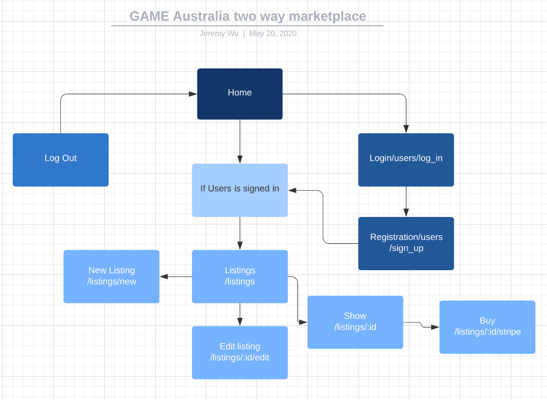

## Screenshots

### Homepage
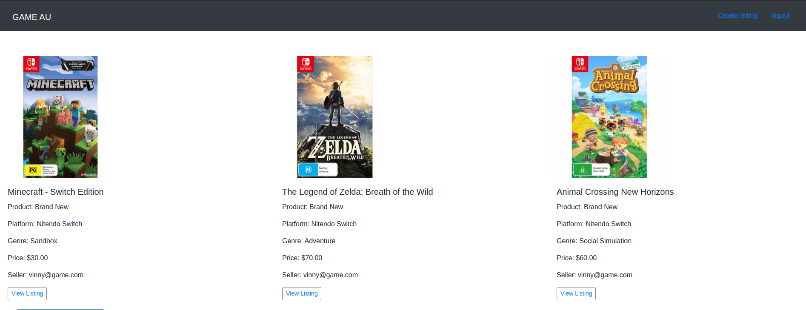

### Sign Up Page

### Login In Page
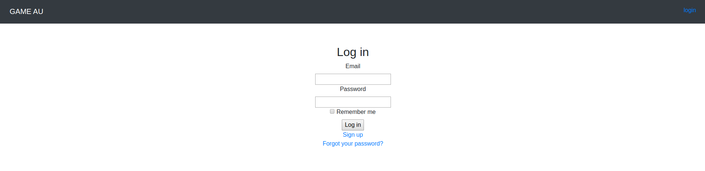

### New Listings Page

### View Listing Page
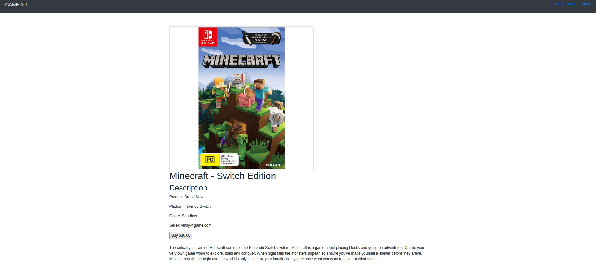

### Edit Listing Page

### Buy Product Page
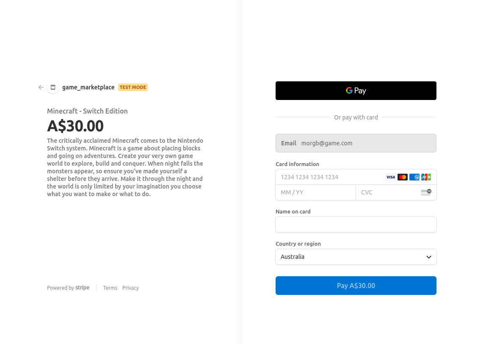

## Target audience

GAME Australia, two way marketplace, is targeted at people who enjoy gaming that are looking for cheaper products that could be new or old. 

## Tech stack

Front-end: HTML5, CSS3, SCSS, Embedded Ruby, Bootstrap.

Back-end: Ruby 2.7.1, Ruby on Rails 5.2.4.

Database: Postgresql, D-Beaver.

Deployment: Heroku.

Biz Tools: Github Projects

Utilities: Stripe, Devise, Ultrahook, AWS S3.

DevOps: Git, Github, VS Code, Balsamiq.

## User stories

The user stories below will describe the users functionality of the features of this marketplace application. 
 
### Users: 

As a site viewer, I want to be able to view listings without needing to sign up.

As a site viewer, I want to be able to sign up to be able to buy or sell products.

As a seller, I want to be able to create listings, to sell products.

As a seller, I want to be able to edit or delete my listings, to correct information on the listing. 

### Purchases:

As a buyer, I want to be able to purchase products from other users' listings.

As a seller, I want to be able to sell products on the site to receive money from the buyers.

As a seller, I want to be able to delete my purchased listing from the site, so other users will not be able to purchase the product again.  

### Authentication & Authorisation:

As a buyer or seller, I don't want other users to edit or delete my listings. 

## Wireframes

### Design 1

### Design 2 

### Final Design

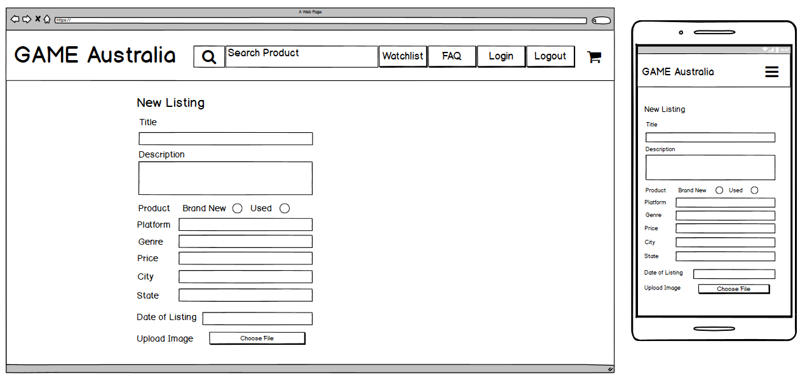

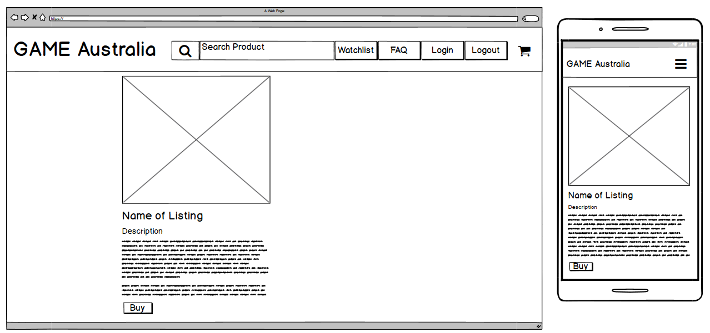

## An ERD for your app

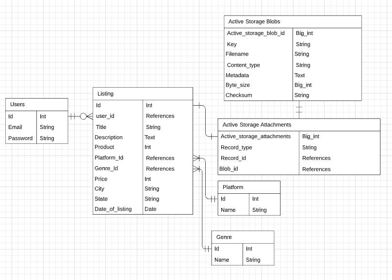

## Explain the different high-level components (abstractions) in your app

GAME Australia is a two way marketplace application that has been created by using Ruby on Rails framework. Ruby on Rails uses a model, view, controller framework, which provides structure to an application by the models being the central component that manages data, logic and rules. The view, which is used to render the user interface such as forms and tables and the controller which is used to input and convert commands to the model and view.  

Postgresql is an open source relational database management system that is used in this application for six models. In the application, certain methods such as authorisation and data sanitising are used to keep the integrity of the database. 

In this application, for users to be able to purchase or create listings on this two way marketplace, users must sign up by creating user accounts and then log in. For this to be able to work, a gem called Devise is used as a flexible authentication solution for viewers of the site to create users accounts to obtain full functionality of the site. When a user is logged in the site, they are able to buy products and create listings but only the user owner of a listing is able to edit or delete a listing, this has been put in place to not allow other users to temper with other users listings. Without these user parameters put in place, users could change pricing of another user's listing to gain competitive advantage in the two way marketplace, which can cause this application to be unpopular to use. 

Amazon S3 is an active storage service, which is used in this application to allow users to upload an image on a listing. 
For users to be able to make purchases on the site, Stripe and Ultrahook are used to make it possible for users to make an online purchase of a product in this two way marketplace. When a user wants to buy a product, they are sent to Stripes checkout page where the information of the product and the seller is displayed and the credit card details for the user to type in to make a successful purchase.

## Detail any third party services that your app will use

### Devise 

Devise is a ruby gem, which is a flexible authentication solution used for Ruby on Rails applications. In this application, it allows viewers of the site to create a user account by providing an email and a password. Devise gives methods such as current_user, which helps with the site functions for users to view different features if its the users listing, the user can edit or delete the list or if not, the user only can only view or buy the listing. 

### Stripe

Stripe is an API that allows users to purchase listings on the site, which provides a secure payment service for users.  

### Amazon S3

Amazon S3 is an active storage service that allows users to upload images to their listing, which are then stored in Amazon S3 cloud-based storage.

### Bootstrap

Bootstrap is a CSS framework that has been used to style this application. This CSS framework allows for quicker styling as it gives set styling methods, which also can be edited in the SCSS stylesheet file. 

## Describe your projects models in terms of the relationships (active record associations) they have with each other

A user has_many listings, a listing belongs_to a user. 

A platform has_many listings, a platform belongs_to a listing. 

A genre has_many listings, a genre belongs_to a listing. 

A listing has_one_attached picture, a picture belongs_to a listing.

A listing belongs_to a user, a user has_many listings.

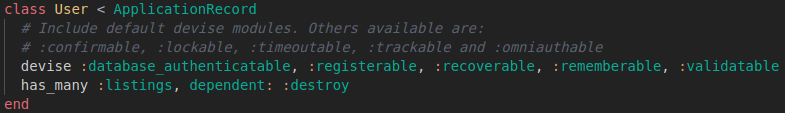

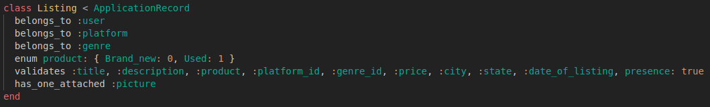

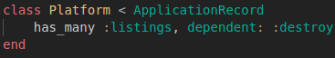

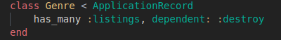

## Discuss the database relations to be implemented in your application

The user table shows an email and a password, which is needed for users of the site to sign up and log in to the site which the user_id is used to track the users listing. 

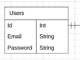

The listing table shows the listing belongs to a user by user_id, which is a foreign key and the table allows shows data that is needed to create a successful listing, which needs a name, description, product type, platform, genre, price and date of listing. 

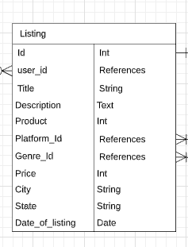

The platform and genre table are both connected to the listings as a genre and platform belong to a listing. This is used by a forigen key which allows an array of different genres and platforms to be used for a listing.

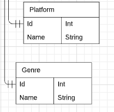

The active storage blobs and active storage attachment tables are connected by a forigen key and are used for users to upload images to a listing, by calling has_one_attached in listing.rb file. The table also holds the data, such as the file name and content type of the image that has been uploaded.  

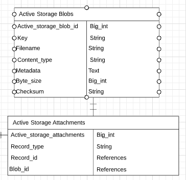

## Provide your database schema design

The images below, show each schema design used in this application.

### Users

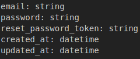

### Listings

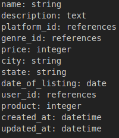

### Platforms

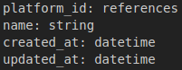

### Genres

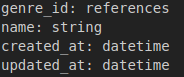

### Active Storage Attachments

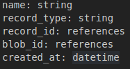

### Active Storage Blobs

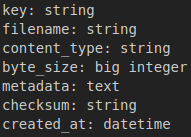

## Describe the way tasks are allocated and tracked in your project

This project has been tracked and managed by using github project board. When creating the project board, the MVP were placed in the to do list then the progress list when a part of the project was being developed then moved to the done list as it was completed. The extra list was created to add optional features to the project if time management of the project would permit it after the MVP was completed. The images below show the progress of the project in different stages. 

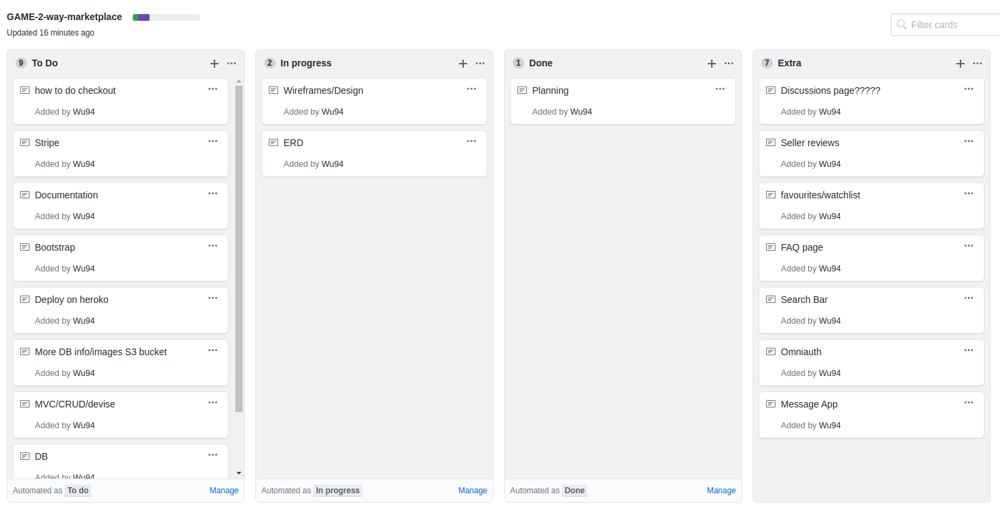

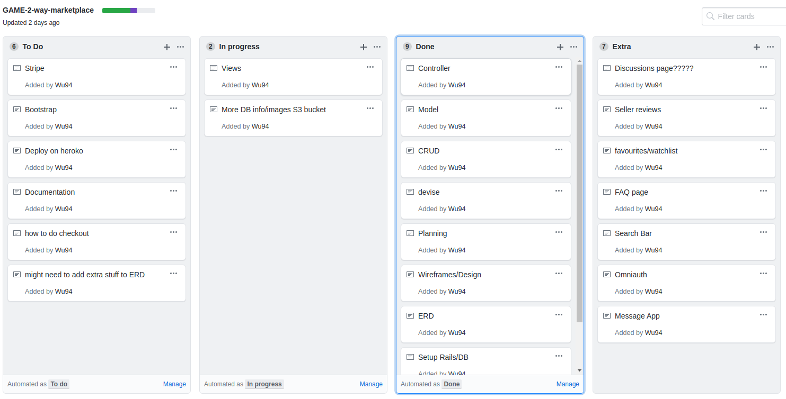

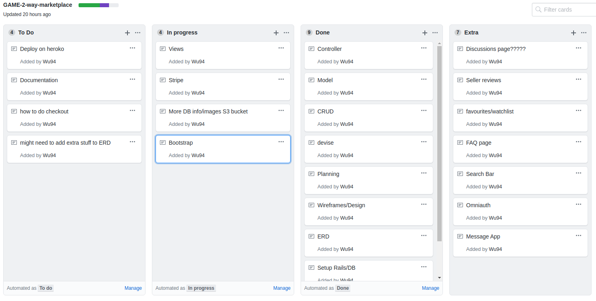

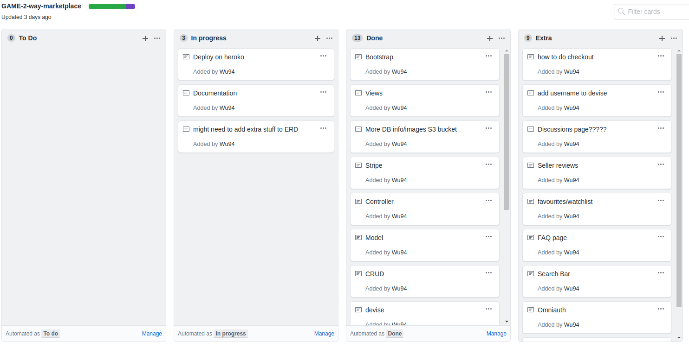

